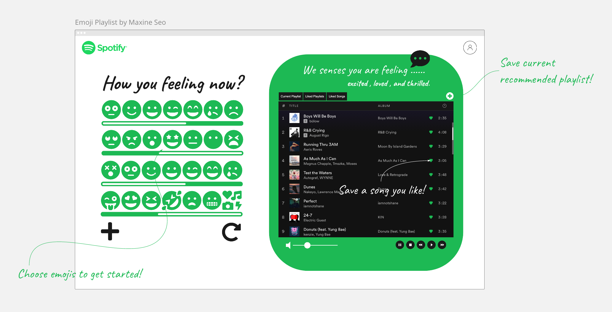

# <b> Emoji Playlist ✨🎵 </b> #
[](https://github.com/MaxineSS/emojique/actions/workflows/main.yml)

This app is for people who want to easily find music in a fun way, based on their feelings, which are curated by emojis.



### Summary ###
  > Select the emoji that best describes your current feelings and _Emoji Playlist_ will recommend you songs and playlists.

### Problem ###
  > Sometimes, there are moments when it's hard to precisely describe one's feelings in words. In the app, the user chooses an emoji that best describes their feelings, and the app recommends music based on emoji values.

### Solution ###
  > Each emoji value is mapped to values of base seeds and entities. Base seeds are artists, genres and tracks. Entitites are valence, instrumentalness, dancebility, and energy. Based on the selected emoji(seeds and entities) values by the user, the app recommends music against similar artists and tracks.
```
✔︎ Input

Feeling {
  base-seeds : [ artists, genres, tracks ]
  entities: [ valence, instrumentalness, danceability, energy]
}
```
```
✔︎ Output

Recommendation {
  tracks: [
    {track},
    {track},
    {track},
    ...
  ]
}

Track {
  id: {spotifyID},
  name: {nameOfTheTrack},
  artists: {[nameOfTheArtist, ...]},
  images: {[{},{},{}]},
  popularity: {100},
  preview_url: {""}
}
```
### Quote from You ###
> Explore new music based on how you feel, and, in a fun way.

### How to Get Started ###
  > 1. Visit [Emoji Playlist](http://emoji-playlist.com)
  > 1. Pick the emojis you like, or that mathes your current feeling. _Emoji Playlist_ will automatically recommend playlists for you.
  > 1. Have fun and enjoy your playlist.

### Customer Quote ###
> What a great idea! Simple to use, and the app always recommends the best songs based on how I feel.

### Closing and Call to Action ###
> Choose an emoji to get started!


### App Stack ###
 Frontend | Backend | Database | API
 ------------ | ------------------------- | ------------- | -------------
 React| Express / Node | MongoDB | Spotify
